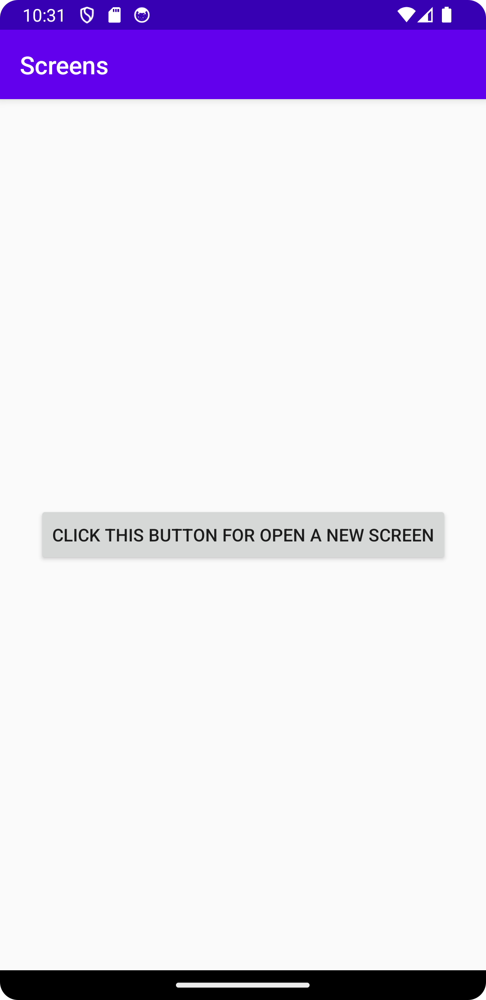
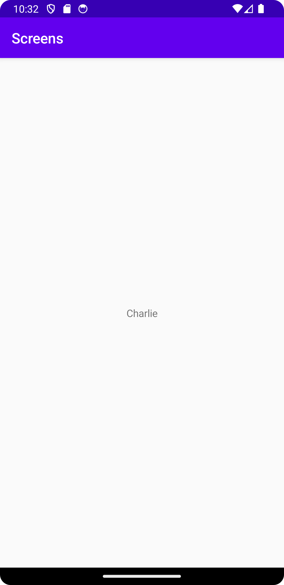

# Rapport

**Intent App**

```
...
// created a button
Button button = findViewById(R.id.button);

// listening for when user clicked a button
button.setOnClickListener( new View.OnClickListener() {
    public void onClick(View v){

        // send intent value to SecondActivity
        Intent intent = new Intent(MainActivity.this, SecondActivity.class);
        intent.putExtra("name", "Charlie");
        startActivity(intent);
    }
});
...
```
Inuti onCreate() skapas en knapp som hämtar id "button" från activity_main.xml med hjälp av findViewById() i filen MainActivity.java.
Sedan finns funktionen som lyssnar när en användare har klickat på knappen och börjar skapa intent värde (Charlie) 
och skickas till en klass SecondActivity från SecondActivity.java.


Här ser ut layout med activity_main.xml.

```
...
// created a textView
TextView textView = findViewById(R.id.textView);

// receive intent value from MainActivity
Bundle extras = getIntent().getExtras();

// check if value is not null
if (extras != null) {
    // get intent name
    String name = extras.getString("name");
    // set from an intent name to a textview
    textView.setText(name);
}
...
```
Inuti onCreate() skapas en textView som hämtar id "textView" från activity_second.xml med hjälp av findViewById() i filen SecondActivity.java.
Sedan hämtar intent värde och kollar om värde är inte null. Om det är sant hämtar värde "Charlie" och sätter in text till textview.


Här ser ut layout med activity_second.xml och visar värde med hjälp av SecondActivity.java kod.

Läs gärna:

- Boulos, M.N.K., Warren, J., Gong, J. & Yue, P. (2010) Web GIS in practice VIII: HTML5 and the canvas element for interactive online mapping. International journal of health geographics 9, 14. Shin, Y. &
- Wunsche, B.C. (2013) A smartphone-based golf simulation exercise game for supporting arthritis patients. 2013 28th International Conference of Image and Vision Computing New Zealand (IVCNZ), IEEE, pp. 459–464.
- Wohlin, C., Runeson, P., Höst, M., Ohlsson, M.C., Regnell, B., Wesslén, A. (2012) Experimentation in Software Engineering, Berlin, Heidelberg: Springer Berlin Heidelberg.
